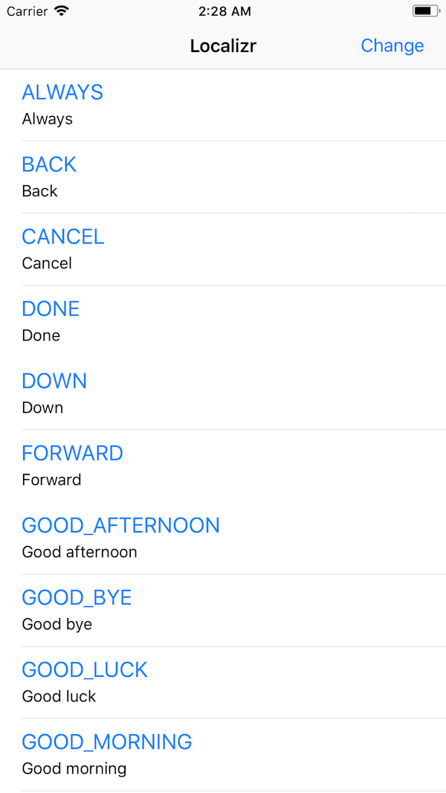
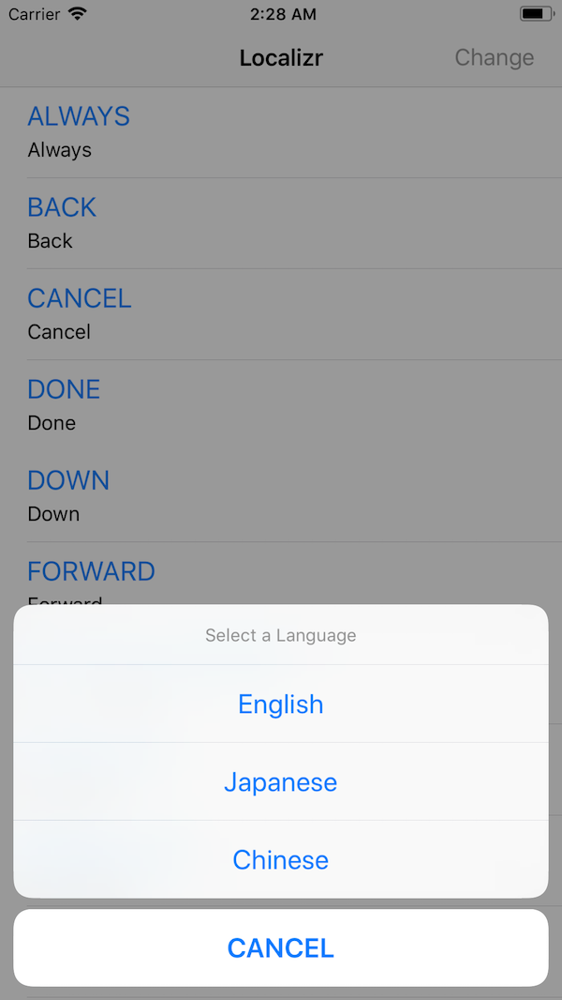
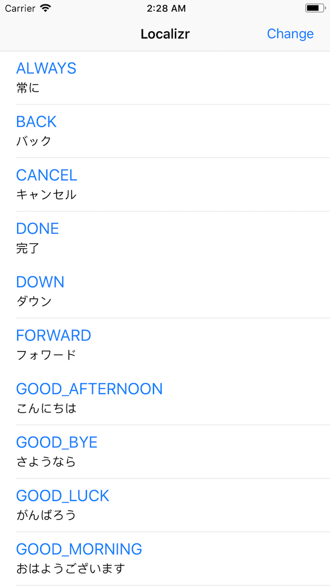

# LocalizrIOSExample
An IOS Implementation for Localizr (https://github.com/michaelhenry/localizr)

At first I did not write anything on the [Localizable.strings](LocalizrIOSExample/Base.lproj/Localizable.strings). As long as we configured the localizr correctly, it can fetch latest localization files from the [Localizr server](https://github.com/michaelhenry/localizr).

You can try this manually by running this command on this project `fastlane ios localized` then try to run the application again, you will see the that the Localizable.strings has changed based on the data from the server.

I do recommend to include the `localizr` action before `gym` if you're using `fastlane`.

## Author

Michael Henry Pantaleon, me@iamkel.net

## License

Localizr is available under the MIT license. See the LICENSE file for more info.
